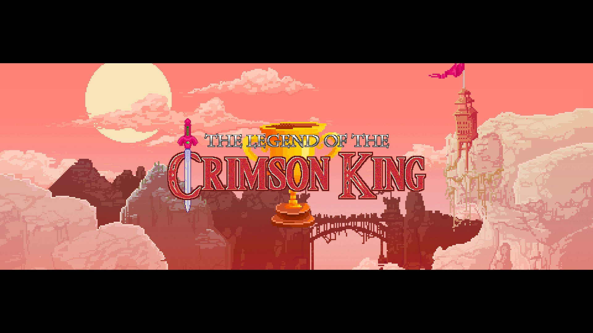
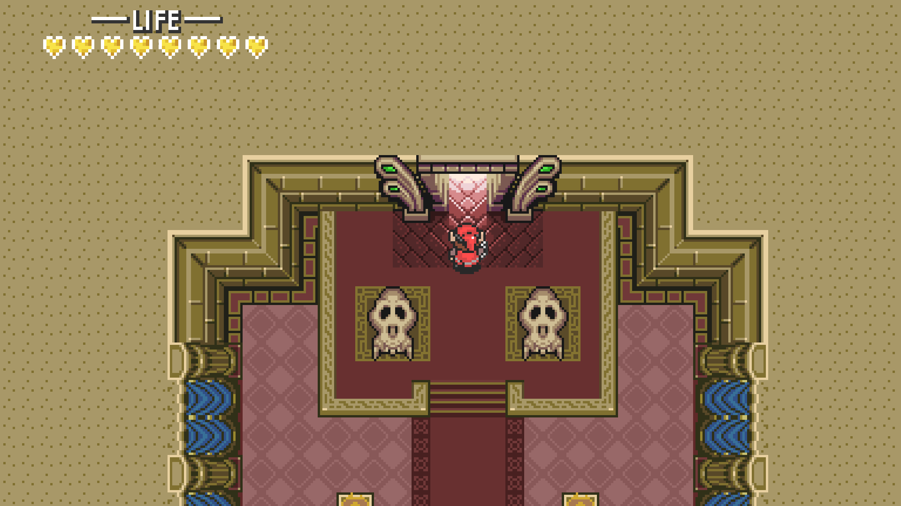
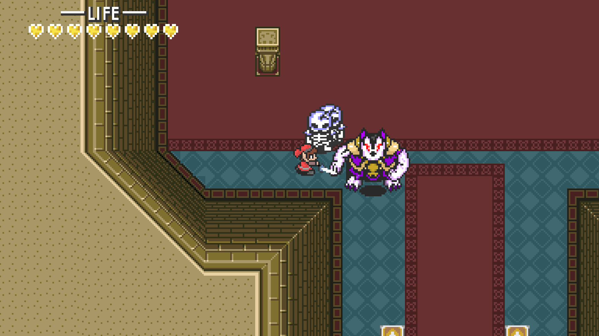
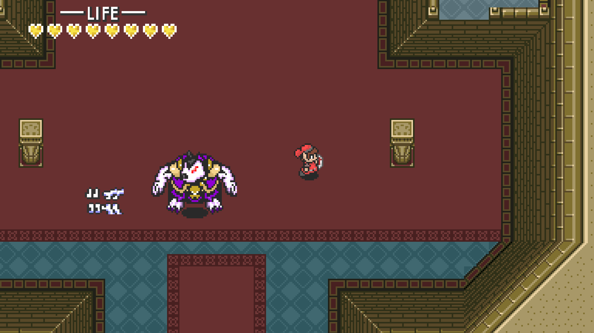

# The Legend of The Crimson King

This game was created by a team of three for an advanced data stuctures course at Washington State University.

You play as a young fantasy hero from the Crimson Kingdom on a quest to defeat the evil Husky King.

This was created with C++ and SFML within Visual Studio 2019.

Trailer:
https://www.youtube.com/watch?v=p0F573dvcco

# BUILD
Currently, there is no build for this yet. To run the game you'll need to install SFML and merge the code here.
To install SFML: https://www.youtube.com/watch?v=YfMQyOw1zik

# NOTE
- Collisions are not currently enabled.
- Audio is not currently enabled.
- The program closes if you die or beat the final boss.

# ARTWORK
- Most artwork in this game is reused from Nintendo's 'The Legend of Zelda: A Link to the Past'
- Some custom sprite sheets and animations were created by me.
- 
# TOOLS
- Visual Studio 2019 
- Tiled 
- Aseprite 
- Paint.net
- Excel (Tilemap generation)

# SCREENSHOTS

